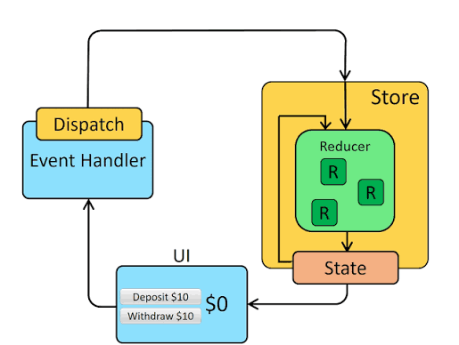

# Redux Toolkit Counter App

A simple React + Redux Toolkit project to understand the complete Redux flow using `configureStore`, `Provider`, `createSlice`, `useSelector`, and `useDispatch`.

---

# Redux Toolkit Summary

Create a Redux store with configureStore

- configureStore accepts a reducer function as a named argument
- configureStore automatically sets up the store with good default settings

Provide the Redux store to the React application components

- Put a React-Redux `<Provider>` component around your `<App />`
- Pass the Redux store as `<Provider store={store}>`

Create a Redux "slice" reducer with createSlice

- Call createSlice with a string name, an initial state, and named reducer functions
- Reducer functions may "mutate" the state using Immer
- Export the generated slice reducer and action creators

Use the React-Redux useSelector/useDispatch hooks in React components

- Read data from the store with the useSelector hook
- Get the dispatch function with the useDispatch hook, and dispatch actions as needed

---

# Redux Flow Diagram



---

# Redux Toolkit Implementation Flow


## 1) Install Redux Toolkit

```bash
# Terminal

npm install @reduxjs/toolkit react-redux
```

---

## 2) Create Redux Store

```javascript
// src/redux/store.js

configureStore({
 reducer:{}
})
```

Creates central Redux store with default settings.

Redux Toolkit automatically enables:

- Redux DevTools
- Good default middleware settings

Flow:

```
Application

     ↓

Redux Store Created

     ↓

{
 
}
```

---

# 3) Provide Redux Store to React App

```jsx
// src/main.jsx

<Provider store={store}>
   <App/>
</Provider>
```

Makes Redux store available to all React components.

Flow:

```
Redux Store

      ↓

<Provider>

      ↓

<App/>

      ↓

All Components
```

---

# 4) Create Redux State Slice

```javascript
// src/redux/features/counterSlice.js


createSlice({
 name:"counter",

 initialState:{
   value:0
 },

 reducers:{
   increment,
   decrement,
   incrementByAmount
 }
})
```

Creates:

- State
- Reducer functions
- Actions


Store data:

```javascript
counter:{
 value:0
}
```


Reducer Example:

```javascript
increment:(state)=>{
 state.value += 1
}
```


Redux Toolkit uses Immer internally.

So we can write:

```javascript
state.value += 1
```

and Immer converts it into safe immutable updates.

---

# 5) Add Slice Reducer into Store

```javascript
// src/redux/store.js


import counterReducer from "./features/counterSlice.js"


configureStore({
 reducer:{
   counter: counterReducer
 }
})
```

Now Redux Store becomes:

```javascript
{
 counter:{
    value:0
 }
}
```


Now we can access:

```javascript
state.counter.value
```

---

# 6) Use Redux inside React Component


## Read Redux Data


```javascript
// src/App.jsx


useSelector()
```


Example:

```javascript
const count = useSelector(
 (state)=>state.counter.value
)
```


Flow:

```
Redux Store

      ↓

counter

      ↓

value

      ↓

React Component
```


---

## Update Redux Data


```javascript
// src/App.jsx


useDispatch()
```


Example:


```javascript
const dispatch = useDispatch()

dispatch(increment())
```


Dispatch sends actions to Redux store.

---

# Final Flow When Button Clicked


```text
// App.jsx → counterSlice.js → store.js → App.jsx


User Click Button


        ↓


dispatch(increment())


        ↓


Action sent to Redux Store


        ↓


counterSlice reducer runs


        ↓


state.value += 1


        ↓


Redux Store Updated


        ↓


useSelector receives new value


        ↓


React Component Re-renders


        ↓


Updated UI Displayed
```

---

# Complete Redux Cycle


```
                 USER INTERFACE
                      |
                      |
                  Button Click
                      |
                      |
                   Dispatch
                      |
                      |
                    Action
                      |
                      |
                  Redux Store
                      |
                      |
                 Slice Reducer
                      |
                      |
               Update State Value
                      |
                      |
                New Store State
                      |
                      |
                 useSelector()
                      |
                      |
                React Re-render
                      |
                      |
                  Updated UI
```

---

# Project File Structure


```
src
│
├── redux
│   │
│   ├── store.js
│   │
│   └── features
│        │
│        └── counterSlice.js
│
│
├── main.jsx
│
└── App.jsx
```


---

# Important Redux Toolkit Concepts


| Concept | Meaning |
|---|---|
| Store | Central place where state lives |
| configureStore | Creates Redux store |
| Provider | Gives Redux access to React |
| Slice | State + Reducers + Actions |
| Reducer | Function that updates state |
| Action | Instruction sent to Redux |
| Dispatch | Sends action to Redux |
| useSelector | Reads data from store |
| useDispatch | Updates data in store |


---

## Simple Definition

Redux Toolkit flow:

Create Store → Provide Store → Create Slice → Add Reducer → Read using useSelector → Update using useDispatch